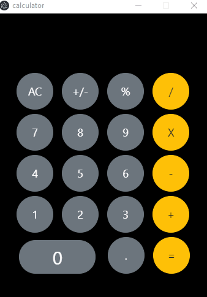

# Calculator




## Project's libs and frameworks
```
Electron, Vue, Bootstrap
```

## Project setup
```
npm install
```

### Compiles and hot-reloads for development
```
npm run electron:serve
```

### Compiles and minifies for production
```
npm run electron:build
```
